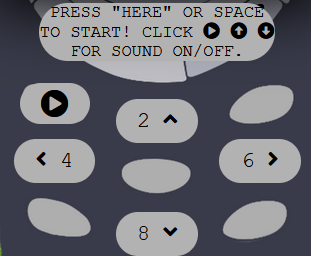
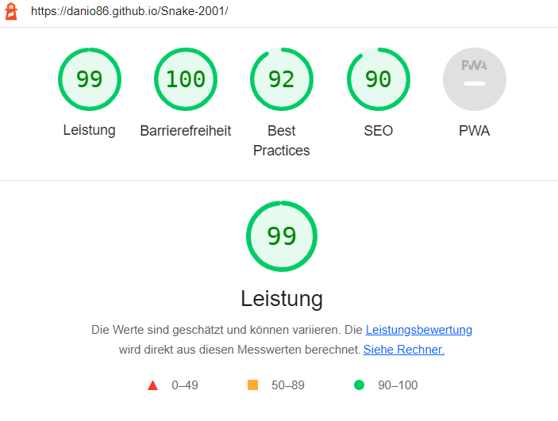

# Snake 2001

Snake 2001 is a recreation of the Snake mobile game that was still played on button phones in the late 90's and 2000's. 
A snake is guided by the player through a playing field and has to collect as much food as possible. The player receives points for this. The more dangerous the food is, the more points the player gets.
This variant contains 3 levels. From level 1 to 2 only the speed changes. In both levels the snake dies if it hits the wall or if it bites itself. In level 3, a wall of fire appears in the middle of the playing field. The outer walls are permeable to it.
As a demonstration, the player already wins when he has reached 500 points.

- Responsice Mockup 
    

## User Stories

- As a visiting user, I can easily understand the main purpose of the game. 
- As a visiting user, I can navigate the snake without any problems.
- As a visiting user, I can learn to navigate the snake more efficiently to earn more points.
- As a visiting user, I can easily get information about the company through their social media links.

## Features 

- __Body__

    - The body contains the Snake 2001 background image. Fern plants are shown, which are supposed to symbolize a rain forest. The image is available for free use on Pixabay.
        - [pixabay](https://pixabay.com/images/search/jungle/?manual_search=1)
    - The body also contains the "Game-Program-Field". This is in turn divided into different areas.

    - __Game Program Field__

     - The Game Field contains a background image. The background image shows an old vintage push button cell phone from the early 2000s. All other features are laid out over the background in a way that makes it look like you are operating this phone.

        - __Header__

            - The header contains the Snake 2001 logo which shows a snake. 
            - The header also includes the headline and score area.
             - The score area shows the current score, the current record score and the current level.
            - The header has a fixed position inside the Game-Program-Field-Window.

        - Header Image: 
            
                    

        - __Playing Field__

            - The actual playing field was created with javascript canvas and is the area where the snake is navigated and the food is placed.
                - The basic code of the Canvas and how to draw and place things inside a Canvas is taken from the following website.
                    - [w3schools](https://www.w3schools.com/graphics/canvas_drawing.asp)
                - Basic functions inside the Canvas (how the snake moves, grows) is taken from the following website.
                    - [Specific YouTube Tutorial] (https://www.youtube.com/watch?v=niD3gx4BI9A&t=4505s)
                - Basic functions inside the Canvas (how moving and drawing functions are constantly repeat) is taken from the following website.
                    - [Specific YouTube Tutorial] (https://www.youtube.com/watch?v=7Azlj0f9vas)

        - Playing Field Image: 
            

        - __The Control Area__

            - The control panel contains the start button and the control buttons of the snake for mobile devices (phones, tablets).Users on devices with a keyboard will be more likely to use the keyboard. The start button contains instructions on how to start the game. 
            - It serves as a user manual and as an intermediate step between the "Game Over Status" and the start of the game. This prevents the end screen ("Game Over" or "You Win") from being clicked away immediately by intuitively continuing to play (a direction key is pressed).
            - The start button changes color by mouse over and by clicking.
            - The control button change color by mouse over.
            - The Control Area idea and basic code is taken form the **Code-Institute Love-Maths-Project** but has been modified.

        - Control Area Image: 
            

        - __The Footer__ 

        - The footer includes links to the relevant social media sites for the Game-Developer Company. The links will open to a new tab to allow easy navigation for the user. 
        - The footer is valuable to the user as it allows them to get Information via social media.
        - The footer idea and basic code is taken form the **Code-Institute Love-Running-Project** but has been slightly modified.

        - The Footer Image: 
            

### Features Left to Implement

  - Planned features: 
    - There will be more levels in the future. The snake should get a face and there should be more animal and vegetable food. Besides that, enemies will come that the snake cannot eat but will harm it. From a later level, the snake should also get out of its box into a 2D world open to the right. In the distant future, the snake could also transition into a 3D world and get more movement options.

## Testing 

- I have tested that the website works in different browsers (Chrome and Firefox).
- I confirm that the website works and looks good on all standard screen sizes. This was tested with the devtools divice toolbar.
- I certify that all the text is easy to read and understand.
- I confirm that the all keys are working.
- I confirm that the all soundeffect are working. All sound effects appear at the right time.

### Validator Testing

  - HTML
      - No errors were returned when passing through the official W3C validator.
      - All web pages have been tested.

  - CSS
      - No errors were found when passing through the official (Jigsaw) validator.

  - JavaScipt 
      - No errors were found when passing through the official (Jigsaw) validator.

  - Accessibility
      - I confirm that the colors and fonts selected are easy to read and accessible. This was discovered using lighthouse in devtools.
      - All web pages have been tested for desktop and mobil devices.

- HTML Validation

- CSS Validation

- JavaScipt Validation

- Lighthouse-Desktop

- Lighthouse-Mobil

- user story besed test cases (screenshots):

  - As a visiting user, I can easily understand the main purpose of the website.
      - Slogan and Slideshow
      

  - As a visiting user, I can navigate the website without any problems.
      - Navigation
      

  - As a visiting user, I will be able to learn about other users and contact them.
      - Info about other user
      

  - As a visiting user, I can easily contact the company service.
      - Company Service
      

### Unfixed Bugs

 - No Bugs are unfixed.
 - There were a few bugs, but they were fixed within a short time. 
  - For example, the Sports category page displayed well in Firefox and not in Google Chrome. The image formatting caused free white areas to appear on the page in Google Chrome. 
  - Another difficulty was the dropdown button (Sport) in the header menu. This had to be formatted separately, just like the other menu buttons.

## Deployment

- The site was deployed to GitHub pages. The steps to deploy are as follows: 
  - In the GitHub repository, navigate to the Settings tab 
  - In menu on the left side, select pages
  - Scrool down to Branch and select main
  - push the Save button
  - Once the master branch has been selected, the page will be automatically refreshed with a detailed ribbon display to indicate the successful deployment. 

The live link can be found [here](https://danio86.github.io/coach-finder/index.html)

## Credits 

In this section you need to reference where you got your content, media and extra help from. It is common practice to use code from other repositories and tutorials, however, it is important to be very specific about these sources to avoid plagiarism. 

You can break the credits section up into Content and Media, depending on what you have included in your project. 

### Content

- Instructions on how to implement form validation on the Login, Sign Up and Sign Up Mistake page was taken from [Code Institute - Love Running Project](https://learn.codeinstitute.net/courses/course-v1:CodeInstitute+LR101+2021_T1/courseware/4a07c57382724cfda5834497317f24d5/4d85cd1a2c57485abbd8ccec8c00732c/)
- All icons were taken from [Font Awesome](https://fontawesome.com/)
- Font styles were taken from [Google Fonts](https://fonts.googleapis.com)
- The basic code of the header dropdown menu is taken from the following website, but has been changed. [w3schools](https://www.w3schools.com/howto/howto_css_dropdown.asp)
- The basic code of the clickable burger button menu is taken from the following website, but has been changed. [Álvaro Trigo](https://alvarotrigo.com/blog/hamburger-menu-css/)
- The basic code of the slide show is taken from the following website, but has been modified. [Specific YouTube Tutorial](https://www.youtube.com/watch?v=0wvrlOyGlq0)
- Instructions on how to implement a google map into a website was taken from [Code Institute - Coders Coffeehouse Project](https://learn.codeinstitute.net/courses/course-v1:CodeInstitute+HE101+2020/courseware/fcc67a894619420399970ae84fc4802f/13db720675f94dbca6b0fe79467628ca/)
- Instructions on how to implement links into the footer was taken from [Code Institute - Love Running Project](https://learn.codeinstitute.net/courses/course-v1:CodeInstitute+LR101+2021_T1/courseware/4a07c57382724cfda5834497317f24d5/e6d4cda2bc08458ba94d2092be9bad3a/)
- Instructions on how to implement Textblocks into Images or maps was taken from [Code Institute - Coders Coffeehouse Project](https://learn.codeinstitute.net/courses/course-v1:CodeInstitute+HE101+2020/courseware/fcc67a894619420399970ae84fc4802f/13db720675f94dbca6b0fe79467628ca/)
- Instructions on how to center content vertically and horizontally was taken from [w3schools](https://www.w3schools.com/howto/howto_css_center-vertical.asp)
- The code for the password	confirmation is taken from [Codepen](https://codepen.io/diegoleme/pen/qBpyvr)

- Color-Scheme
  

### Media

- The Images used on all pages, except the sport-category page and trainer photos on the specific-sport page are from this Open Source site [Pixabay](https://pixabay.com/de/)
- The photos used for the coaches on the specific-sport page were taken from [Wikipedia](https://de.wikipedia.org/wiki/Wikipedia:Hauptseite). The authors must be specified in each case.
  - [Jürgen Klopp: Von Fars Media Corporation, CC-BY 4.0,](https://commons.wikimedia.org/w/index.php?curid=81344322)
  - [Pep Guardiola: Von Football.ua, CC BY-SA 3.0,](https://commons.wikimedia.org/w/index.php?curid=71584908)
  - [Steffi Jones: Von © Raimond Spekking / CC BY-SA 4.0 (via Wikimedia Commons), CC BY-SA 4.0,](https://commons.wikimedia.org/w/index.php?curid=25424821)
  - [José Mourinho: Von Дмитрий Голубович - https://www.soccer0010.com/galery/1013397/photo/673146, CC BY-SA 3.0,](https://commons.wikimedia.org/w/index.php?curid=62794666)
  - [Zinédine Zidane: Von Tasnim News Agency, CC-BY 4.0,](https://commons.wikimedia.org/w/index.php?curid=64815490)
  - [Hansi Flick: Von Steffen Prößdorf, CC BY-SA 4.0,](https://commons.wikimedia.org/w/index.php?curid=121296260)

### Personal Advice

  - Thank You!
    -  Jubril Akolade
    - All people from my Slack Group!